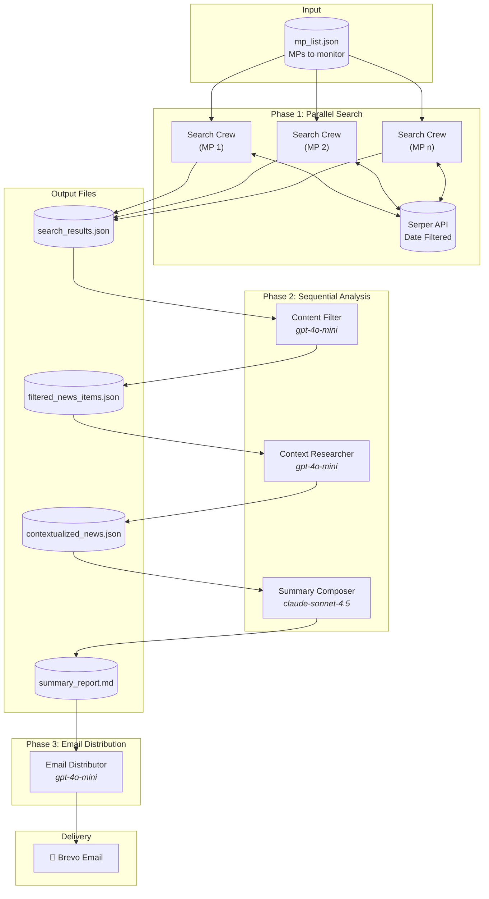

# MP News Feed

A multi-agent system powered by [crewAI](https://crewai.com) that monitors news about Members of Parliament (MPs) and delivers curated strategic reports via email.

## What It Does

1. **Searches** for recent news about each MP in your monitoring list
2. **Filters** results by relevance and quality (score 6+)
3. **Adds context** with political background and significance
4. **Composes** a strategic summary highlighting collaboration opportunities
5. **Delivers** the report via email

## Installation

Requires Python >=3.10 <3.14 and [uv](https://docs.astral.sh/uv/):

```bash
pip install uv
crewai install
```

## Configuration

1. Copy the example files:
```bash
cp .env.example .env
cp knowledge/mp_list.example.json knowledge/mp_list.json
```

2. Add your API keys to `.env`:
```
OPENAI_API_KEY=your_key
ANTHROPIC_API_KEY=your_key
SERPER_API_KEY=your_key
SENDGRID_API_KEY=your_key
```

3. Edit `knowledge/mp_list.json` with your MPs:
```json
[
  {"name": "John Doe", "country": "Germany"},
  {"name": "Jane Smith", "country": "France"}
]
```

## Usage

```bash
# Run all phases
uv run python src/mp_news_feed/main.py

# Or run phases independently
uv run python src/mp_news_feed/main.py --search-only    # Phase 1: Search only
uv run python src/mp_news_feed/main.py --analyze-only   # Phase 2: Analysis only
uv run python src/mp_news_feed/main.py --email-only     # Phase 3: Email only
```

Running phases independently is useful for:
- Iterating on report quality without re-running expensive searches
- Testing email delivery with existing reports
- Debugging individual pipeline stages

Outputs are written to `output/`:
- `search_results.json` - Raw search results
- `filtered_news_items.json` - Filtered and scored items
- `contextualized_news.json` - Items with political context
- `summary_report.md` - Final strategic report

## Architecture

The system uses a three-phase approach that can be run together or independently:



**Phase 1: Parallel Search** (`--search-only`)
- Searches all MPs concurrently using `kickoff_for_each_async()`
- Uses date-filtered Serper API (past 8 months)

**Phase 2: Sequential Analysis** (`--analyze-only`)
- `content_filter` → `context_researcher` → `summary_composer`
- Summary uses Claude Sonnet 4.5 for high-quality strategic insights
- Includes footnote references to source articles

**Phase 3: Email Distribution** (`--email-only`)
- Sends the report via Brevo email API

## Support

- [crewAI Documentation](https://docs.crewai.com)
- [crewAI GitHub](https://github.com/joaomdmoura/crewai)
- [crewAI Discord](https://discord.com/invite/X4JWnZnxPb)
