# MP News Feed

A multi-agent system powered by [crewAI](https://crewai.com) that monitors news about Members of Parliament (MPs) and delivers curated strategic reports via email.

## What It Does

1. **Searches** for recent news about each MP in your monitoring list
2. **Filters** results by relevance and quality (score 6+)
3. **Adds context** with political background and significance
4. **Composes** a strategic summary highlighting collaboration opportunities
5. **Delivers** the report via email

## Installation

Requires Python >=3.10 <3.14 and [uv](https://docs.astral.sh/uv/):

```bash
pip install uv
crewai install
```

## Configuration

1. Copy the example files:
```bash
cp .env.example .env
cp knowledge/mp_list.example.json knowledge/mp_list.json
```

2. Add your API keys to `.env`:
```
OPENAI_API_KEY=your_key
ANTHROPIC_API_KEY=your_key
SERPER_API_KEY=your_key
SENDGRID_API_KEY=your_key
```

3. Edit `knowledge/mp_list.json` with your MPs:
```json
[
  {"name": "John Doe", "country": "Germany"},
  {"name": "Jane Smith", "country": "France"}
]
```

## Usage

```bash
crewai run
```

Outputs are written to `output/`:
- `search_results.json` - Raw search results
- `filtered_news_items.json` - Filtered and scored items
- `contextualized_news.json` - Items with political context
- `summary_report.md` - Final strategic report

## Architecture

The system uses a two-phase approach:

```mermaid
flowchart TB
    subgraph Input
        MP[("mp_list.json<br/>MPs to monitor")]
    end

    subgraph Phase1["Phase 1: Parallel Search"]
        direction LR
        SC1["Search Crew<br/>(MP 1)"]
        SC2["Search Crew<br/>(MP 2)"]
        SC3["Search Crew<br/>(MP n)"]
        SERPER[("Serper API<br/>Date Filtered")]
    end

    subgraph Phase2["Phase 2: Sequential Analysis"]
        direction TB
        CF["Content Filter<br/><i>gpt-4o-mini</i>"]
        CR["Context Researcher<br/><i>gpt-4o-mini</i>"]
        SM["Summary Composer<br/><i>claude-sonnet-4.5</i>"]
        ED["Email Distributor<br/><i>gpt-4o-mini</i>"]
    end

    subgraph Output["Output Files"]
        direction TB
        O1[("search_results.json")]
        O2[("filtered_news_items.json")]
        O3[("contextualized_news.json")]
        O4[("summary_report.md")]
    end

    subgraph Delivery
        EMAIL["📧 Brevo Email"]
    end

    MP --> SC1 & SC2 & SC3
    SC1 & SC2 & SC3 <--> SERPER
    SC1 & SC2 & SC3 --> O1
    O1 --> CF
    CF --> O2
    O2 --> CR
    CR --> O3
    O3 --> SM
    SM --> O4
    O4 --> ED
    ED --> EMAIL
```



**Phase 1: Parallel Search**
- Searches all MPs concurrently using `kickoff_for_each_async()`
- Uses date-filtered Serper API (past 8 months)

**Phase 2: Sequential Analysis**
- `content_filter` → `context_researcher` → `summary_composer` → `email_distributor`
- Summary uses Claude Sonnet 4.5 for high-quality strategic insights

## Support

- [crewAI Documentation](https://docs.crewai.com)
- [crewAI GitHub](https://github.com/joaomdmoura/crewai)
- [crewAI Discord](https://discord.com/invite/X4JWnZnxPb)
